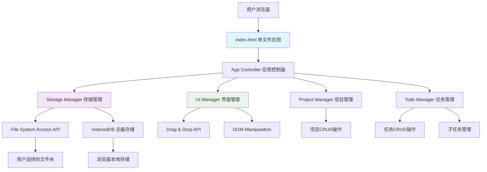
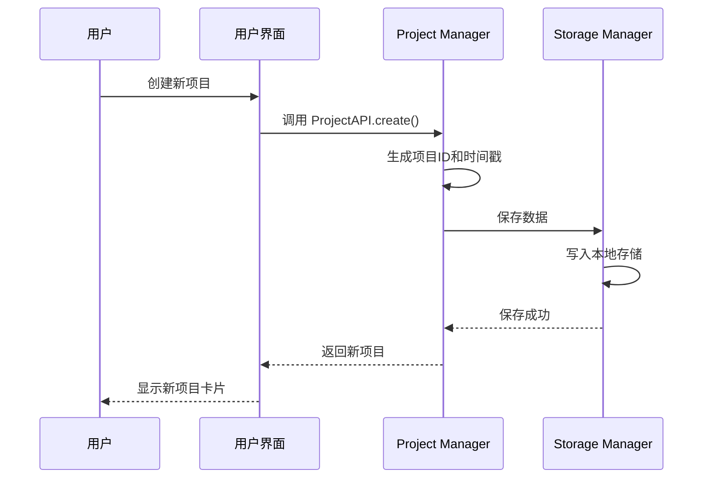
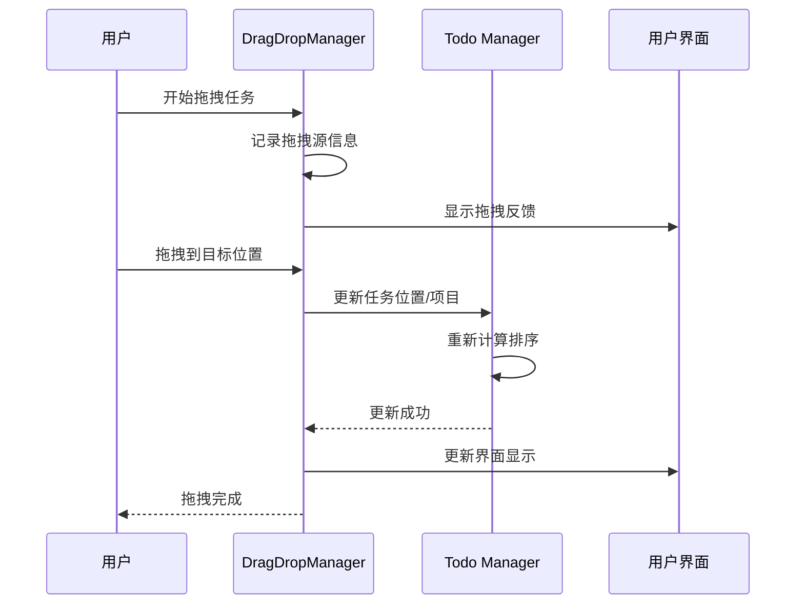
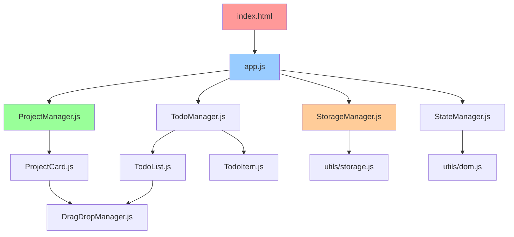
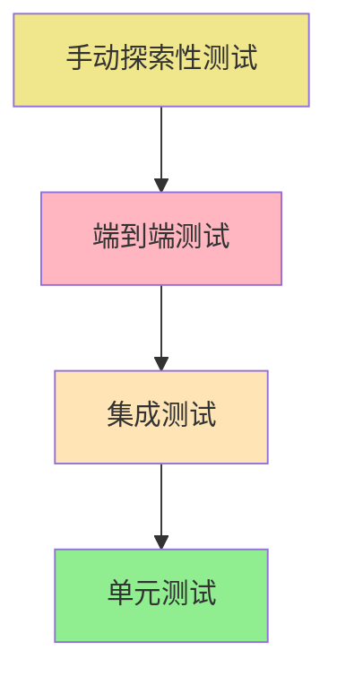

# 独立开发者Todo工具 - 全栈架构文档

## Introduction

本文档定义了独立开发者Todo工具的完整技术架构，基于纯前端、零依赖的设计理念，为独立开发者提供简洁、高效的项目管理解决方案。

### Starter Template or Existing Project
**项目类型：** 全新项目 - 从零开始设计的独立开发者专用Todo管理工具

### Change Log
| 日期 | 版本 | 描述 | 作者 |
|------|------|------|------|
| 2025-08-07 | 1.0 | 初始架构文档创建 | Winston (架构师) |

## High Level Architecture

### Technical Summary
独立开发者Todo工具采用**纯前端单页面应用**架构，完全运行在用户浏览器中，无需后端服务器。通过File System Access API实现用户自主数据存储，IndexedDB作为后备方案，确保数据安全和隐私保护。

### Platform and Infrastructure Choice
- **平台选择：** Web应用，基于现代浏览器
- **部署方式：** 静态文件部署，支持本地运行
- **基础设施：** 零服务器依赖，纯客户端架构
- **数据存储：** 本地文件系统 + IndexedDB双重保障

### Repository Structure
```
todo-tool/
├── index.html              # 单文件应用入口
├── assets/
│   ├── styles/
│   │   ├── main.css        # 主样式文件
│   │   ├── components.css  # 组件样式
│   │   └── themes.css      # 主题定制
│   ├── scripts/
│   │   ├── app.js          # 应用主逻辑
│   │   ├── storage.js      # 数据存储模块
│   │   ├── drag-drop.js    # 拖拽功能
│   │   └── utils.js        # 工具函数
│   └── icons/
│       └── svg/            # SVG图标集
├── docs/
│   ├── prd.md              # 产品需求文档
│   ├── front-end-spec.md   # 前端规范
│   └── user-guide.md       # 用户指南
└── tests/
    ├── unit/               # 单元测试
    └── integration/        # 集成测试
```

### Architecture Diagram


### Architectural Patterns
- **MVC架构模式：** Model(数据层) + View(DOM) + Controller(业务逻辑)
- **模块化设计：** ES6模块分离关注点，保持代码清晰
- **事件驱动：** DOM事件 + 自定义事件实现组件通信
- **单一职责：** 每个模块专注特定功能域
- **依赖注入：** 通过配置对象管理模块依赖关系

## Tech Stack

### Frontend Technologies
| 技术 | 版本 | 用途 | 理由 |
|------|------|------|------|
| HTML5 | Living Standard | 页面结构，拖拽API | 语义化标签，原生拖拽支持 |
| CSS3 | Living Standard | 样式和布局 | Grid/Flexbox，CSS变量，动画 |
| JavaScript | ES2020+ | 业务逻辑 | 原生模块，异步API，现代语法 |
| Web APIs | 现代浏览器 | 系统集成 | File System Access，IndexedDB |

### Development Tools
| 工具 | 用途 | 必要性 |
|------|------|--------|
| VS Code | 开发环境 | 推荐 |
| Live Server | 本地服务器 | 开发阶段 |
| Chrome DevTools | 调试和性能 | 必需 |
| Git | 版本控制 | 必需 |

### Browser Support
- **Chrome 80+** (主要目标)
- **Firefox 75+** (完整支持)
- **Safari 13+** (基本支持)
- **Edge 80+** (完整支持)

### Testing
| 类型 | 工具 | 覆盖范围 |
|------|------|----------|
| 单元测试 | Vanilla JS + QUnit | 核心功能模块 |
| 集成测试 | Puppeteer | 用户交互流程 |
| 手动测试 | 跨浏览器 | UI和拖拽功能 |

## Data Models

### Project Model (项目模型)
```typescript
interface Project {
  id: string;                    // 唯一标识符
  name: string;                  // 项目名称
  description?: string;          // 项目描述
  status: 'active' | 'completed'; // 项目状态
  createdAt: Date;               // 创建时间
  updatedAt: Date;               // 更新时间
  order: number;                 // 排序权重
  urls?: ProjectUrl[];           // 快速访问链接
  tags?: string[];               // 项目标签
  todos: Todo[];                 // 嵌套任务列表
}

interface ProjectUrl {
  name: string;                  // 链接名称
  url: string;                   // 链接地址
  icon?: string;                 // 图标
}
```

### Todo Model (任务模型)
```typescript
interface Todo {
  id: string;                    // 唯一标识符
  content: string;               // 任务内容
  status: 'pending' | 'in-progress' | 'completed'; // 任务状态
  priority: 'low' | 'medium' | 'high'; // 优先级
  createdAt: Date;               // 创建时间
  updatedAt: Date;               // 更新时间
  order: number;                 // 排序权重
  tags?: string[];               // 任务标签
  subtasks?: Subtask[];          // 子任务列表
}
```

### Subtask Model (子任务模型)
```typescript
interface Subtask {
  id: string;                    // 唯一标识符
  content: string;               // 子任务内容
  status: 'pending' | 'completed'; // 子任务状态
  createdAt: Date;               // 创建时间
  updatedAt: Date;               // 更新时间
  order: number;                 // 排序权重
}
```

### Application Data Model (应用数据模型)
```typescript
interface AppData {
  version: string;               // 数据格式版本
  projects: Project[];           // 项目列表
  settings: AppSettings;         // 应用设置
  metadata: {
    createdAt: Date;
    lastModified: Date;
    totalProjects: number;
    totalTodos: number;
  };
}

interface AppSettings {
  storagePath?: string;          // 存储路径
  theme: 'light' | 'dark' | 'auto'; // 主题设置
  autoSave: boolean;             // 自动保存
  showCompletedProjects: boolean; // 显示完成项目
}
```

## API Specification

### REST-style Data API

由于是纯前端应用，API指的是数据操作接口模式，模拟REST风格便于理解和扩展。

#### Project API
```javascript
// 获取所有项目
ProjectAPI.getAll()
// 返回: Promise<Project[]>

// 根据ID获取项目
ProjectAPI.getById(id)
// 参数: id: string
// 返回: Promise<Project | null>

// 创建新项目
ProjectAPI.create(projectData)
// 参数: projectData: Omit<Project, 'id' | 'createdAt' | 'updatedAt'>
// 返回: Promise<Project>

// 更新项目
ProjectAPI.update(id, updates)
// 参数: id: string, updates: Partial<Project>
// 返回: Promise<Project>

// 删除项目
ProjectAPI.delete(id)
// 参数: id: string
// 返回: Promise<boolean>

// 更新项目排序
ProjectAPI.updateOrder(projectOrders)
// 参数: projectOrders: {id: string, order: number}[]
// 返回: Promise<boolean>
```

#### Todo API
```javascript
// 获取项目下的所有任务
TodoAPI.getAll()
// 返回: Promise<Todo[]>

// 获取项目下的所有任务
TodoAPI.getByProjectId(projectId)
// 参数: projectId: string
// 返回: Promise<Todo[]>

// 根据ID获取任务
TodoAPI.getById(id)
// 参数: id: string
// 返回: Promise<Todo | null>

// 创建新任务
TodoAPI.create(projectId, todoData)
// 参数: projectId: string, todoData: Omit<Todo, 'id' | 'createdAt' | 'updatedAt'>
// 返回: Promise<Todo>

// 更新任务
TodoAPI.update(id, updates)
// 参数: id: string, updates: Partial<Todo>
// 返回: Promise<Todo>

// 更新任务状态
TodoAPI.updateStatus(id, status)
// 参数: id: string, status: 'pending' | 'in-progress' | 'completed'
// 返回: Promise<Todo>

// 删除任务
TodoAPI.delete(id)
// 参数: id: string
// 返回: Promise<boolean>

// 更新任务排序
TodoAPI.updateOrder(projectId, todoOrders)
// 参数: projectId: string, todoOrders: {id: string, order: number}[]
// 返回: Promise<boolean>

// 移动任务到其他项目
TodoAPI.moveToProject(todoId, targetProjectId, order?)
// 参数: todoId: string, targetProjectId: string, order?: number
// 返回: Promise<Todo>
```

#### Subtask API
```javascript
// 获取任务下的所有子任务
SubtaskAPI.getByTodoId(todoId)
// 参数: todoId: string
// 返回: Promise<Subtask[]>

// 根据ID获取子任务
SubtaskAPI.getById(id)
// 参数: id: string
// 返回: Promise<Subtask | null>

// 创建新子任务
SubtaskAPI.create(todoId, subtaskData)
// 参数: todoId: string, subtaskData: Omit<Subtask, 'id' | 'createdAt' | 'updatedAt'>
// 返回: Promise<Subtask>

// 更新子任务
SubtaskAPI.update(id, updates)
// 参数: id: string, updates: Partial<Subtask>
// 返回: Promise<Subtask>

// 更新子任务状态
SubtaskAPI.updateStatus(id, status)
// 参数: id: string, status: 'pending' | 'completed'
// 返回: Promise<Subtask>

// 删除子任务
SubtaskAPI.delete(id)
// 参数: id: string
// 返回: Promise<boolean>

// 更新子任务排序
SubtaskAPI.updateOrder(todoId, subtaskOrders)
// 参数: todoId: string, subtaskOrders: {id: string, order: number}[]
// 返回: Promise<boolean>
```

#### URL Management API
```javascript
// 获取项目的所有URL
ProjectUrlAPI.getByProjectId(projectId)
// 参数: projectId: string
// 返回: Promise<ProjectUrl[]>

// 添加项目URL
ProjectUrlAPI.create(projectId, urlData)
// 参数: projectId: string, urlData: {name: string, url: string, icon?: string}
// 返回: Promise<ProjectUrl>

// 更新项目URL
ProjectUrlAPI.update(urlId, updates)
// 参数: urlId: string, updates: Partial<ProjectUrl>
// 返回: Promise<ProjectUrl>

// 删除项目URL
ProjectUrlAPI.delete(urlId)
// 参数: urlId: string
// 返回: Promise<boolean>

// 验证URL有效性
ProjectUrlAPI.validateUrl(url)
// 参数: url: string
// 返回: Promise<{valid: boolean, error?: string}>
```

#### Storage API
```javascript
// 保存数据到文件系统
StorageAPI.saveToFile(data, filename?)
// 参数: data: AppData, filename?: string
// 返回: Promise<boolean>

// 从文件系统加载数据
StorageAPI.loadFromFile()
// 返回: Promise<AppData | null>

// 导出数据
StorageAPI.exportData(format)
// 参数: format: 'json' | 'csv'
// 返回: Promise<Blob>

// 导入数据
StorageAPI.importData(file)
// 参数: file: File
// 返回: Promise<AppData>

// 设置存储路径
StorageAPI.setStoragePath()
// 返回: Promise<string | null>

// 获取当前存储路径
StorageAPI.getCurrentStoragePath()
// 返回: Promise<string | null>

// 创建备份
StorageAPI.createBackup()
// 返回: Promise<{filename: string, success: boolean}>

// 获取备份列表
StorageAPI.getBackupList()
// 返回: Promise<{filename: string, createdAt: Date, size: number}[]>

// 从备份恢复
StorageAPI.restoreFromBackup(backupFilename)
// 参数: backupFilename: string
// 返回: Promise<AppData>
```

#### Settings API
```javascript
// 获取所有设置
SettingsAPI.getAll()
// 返回: Promise<AppSettings>

// 获取特定设置
SettingsAPI.get(key)
// 参数: key: keyof AppSettings
// 返回: Promise<any>

// 更新设置
SettingsAPI.update(settings)
// 参数: settings: Partial<AppSettings>
// 返回: Promise<AppSettings>

// 重置设置到默认值
SettingsAPI.reset()
// 返回: Promise<AppSettings>

// 导入设置
SettingsAPI.importSettings(settingsData)
// 参数: settingsData: AppSettings
// 返回: Promise<AppSettings>

// 导出设置
SettingsAPI.exportSettings()
// 返回: Promise<Blob>
```

#### Validation API
```javascript
// 验证项目数据
ValidationAPI.validateProject(projectData)
// 参数: projectData: Partial<Project>
// 返回: {valid: boolean, errors: string[]}

// 验证任务数据
ValidationAPI.validateTodo(todoData)
// 参数: todoData: Partial<Todo>
// 返回: {valid: boolean, errors: string[]}

// 验证子任务数据
ValidationAPI.validateSubtask(subtaskData)
// 参数: subtaskData: Partial<Subtask>
// 返回: {valid: boolean, errors: string[]}

// 验证导入数据完整性
ValidationAPI.validateImportData(data)
// 参数: data: any
// 返回: {valid: boolean, errors: string[], warnings: string[]}

// 验证URL格式
ValidationAPI.validateUrl(url)
// 参数: url: string
// 返回: {valid: boolean, error?: string}
```

## Components

### Core Components

#### 1. ProjectCard Component (项目卡片组件)
**功能：** 完整的项目管理单元，包含项目信息、状态管理和任务展示

**主要特性：**
- 项目基本信息展示和编辑
- 项目状态切换（活跃/完成）
- 嵌套任务列表管理
- 拖拽排序支持
- URL快速访问

#### 2. TodoList Component (任务列表组件)
**功能：** 管理项目下的所有任务，支持完整的CRUD操作

**主要特性：**
- 任务的增删改查
- 任务状态管理
- 拖拽排序
- 子任务管理

#### 3. DragDropManager (拖拽管理器)
**功能：** 统一管理所有拖拽交互，确保一致的用户体验

**主要特性：**
- HTML5 Drag & Drop API封装
- 项目卡片拖拽排序
- 任务拖拽排序
- 跨项目任务移动

#### 4. StorageManager (存储管理器)
**功能：** 统一管理数据持久化，支持多种存储方式

**主要特性：**
- File System Access API集成
- IndexedDB后备存储
- 数据导入导出
- 自动备份机制

## External APIs

### File System Access API
**用途：** 允许用户选择存储文件夹，实现真正的本地文件管理

**集成方式：**
```javascript
// 请求目录访问权限
const directoryHandle = await window.showDirectoryPicker();

// 创建或获取文件
const fileHandle = await directoryHandle.getFileHandle('data.json', { create: true });

// 读写文件
const writable = await fileHandle.createWritable();
await writable.write(JSON.stringify(data));
await writable.close();
```

### IndexedDB API
**用途：** 作为File System Access API的后备存储方案

**数据结构：**
- `projects` 对象存储：存储所有项目数据
- `settings` 对象存储：存储应用设置
- `backups` 对象存储：存储自动备份

## Core Workflows

### 项目管理工作流


### 任务拖拽工作流


## Database Schema

### IndexedDB Schema
```javascript
// 数据库名称: TodoToolDB
// 版本: 1

// 对象存储: projects
{
  keyPath: "id",
  indexes: {
    "status": { keyPath: "status" },
    "createdAt": { keyPath: "createdAt" },
    "order": { keyPath: "order" }
  }
}

// 对象存储: settings
{
  keyPath: "key"
}

// 对象存储: backups
{
  keyPath: "timestamp"
}
```

### File System Schema
```
用户选择的文件夹/
├── todo-data.json          # 主数据文件
├── backups/
│   ├── backup-YYYY-MM-DD-HH-mm.json
│   └── ...
└── exports/
    ├── export-YYYY-MM-DD.json
    └── ...
```

## Frontend Architecture

### Component Architecture
**架构模式：** 模块化MVC，每个组件自包含

**目录结构：**
```
scripts/
├── app.js              # 应用入口和路由
├── components/
│   ├── ProjectCard.js
│   ├── TodoList.js
│   ├── TodoItem.js
│   └── SettingsModal.js
├── managers/
│   ├── ProjectManager.js
│   ├── TodoManager.js
│   ├── StorageManager.js
│   └── DragDropManager.js
├── utils/
│   ├── dom.js
│   ├── storage.js
│   └── validation.js
└── config.js
```

### State Management
**方案：** 简单的发布-订阅模式，避免过度复杂化

```javascript
class StateManager {
  constructor() {
    this.state = {};
    this.listeners = {};
  }
  
  setState(updates) {
    this.state = { ...this.state, ...updates };
    this.notifyListeners();
  }
  
  subscribe(key, callback) {
    if (!this.listeners[key]) this.listeners[key] = [];
    this.listeners[key].push(callback);
  }
}
```

### Routing Architecture
**方案：** 单页面应用，基于锚点的简单路由

**路由规则：**
- `#/` - 默认首页，显示活跃项目
- `#/completed` - 显示完成项目
- `#/settings` - 设置页面

## Backend Architecture

**说明：** 此应用为纯前端架构，无后端服务器。所有数据处理和业务逻辑都在客户端完成。

### Service Architecture
**架构类型：** 客户端应用，无服务器依赖

**服务边界：**
- **数据服务：** 本地文件系统 + IndexedDB
- **业务逻辑：** 浏览器JavaScript引擎
- **用户界面：** DOM + CSS渲染引擎

### Database Architecture
**数据库类型：** 混合存储方案

**主存储：** File System Access API
- 用户完全控制数据位置
- 支持网盘同步
- 便于备份和迁移

**备用存储：** IndexedDB
- 浏览器不支持File System Access时自动降级
- 提供基本的本地持久化能力

### Authentication and Authorization
**认证方案：** 无需认证，纯本地应用

**安全考虑：**
- 数据完全存储在用户设备
- 无网络传输，无隐私泄露风险
- 用户拥有数据的完整控制权

## Unified Project Structure

### Monorepo Structure
```
todo-tool/
├── README.md                    # 项目说明
├── index.html                   # 应用入口
├── manifest.json                # PWA清单文件
├── service-worker.js            # 服务工作者（可选）
│
├── assets/                      # 静态资源
│   ├── styles/
│   │   ├── main.css            # 主样式
│   │   ├── components.css      # 组件样式
│   │   ├── themes.css          # 主题样式
│   │   └── responsive.css      # 响应式样式
│   │
│   ├── scripts/
│   │   ├── app.js              # 应用主入口
│   │   ├── config.js           # 配置管理
│   │   │
│   │   ├── components/         # UI组件
│   │   │   ├── ProjectCard.js
│   │   │   ├── TodoList.js
│   │   │   ├── TodoItem.js
│   │   │   ├── SubtaskItem.js
│   │   │   └── SettingsModal.js
│   │   │
│   │   ├── managers/           # 业务管理器
│   │   │   ├── ProjectManager.js
│   │   │   ├── TodoManager.js
│   │   │   ├── StorageManager.js
│   │   │   ├── DragDropManager.js
│   │   │   └── StateManager.js
│   │   │
│   │   └── utils/              # 工具函数
│   │       ├── dom.js
│   │       ├── storage.js
│   │       ├── validation.js
│   │       └── helpers.js
│   │
│   └── icons/                  # 图标资源
│       ├── project.svg
│       ├── todo.svg
│       ├── settings.svg
│       └── drag-handle.svg
│
├── docs/                       # 文档
│   ├── prd.md                  # 产品需求文档
│   ├── architecture.md         # 架构文档
│   ├── front-end-spec.md       # 前端规范
│   ├── user-guide.md           # 用户指南
│   └── api-docs.md             # API文档
│
├── tests/                      # 测试文件
│   ├── unit/
│   │   ├── ProjectManager.test.js
│   │   ├── TodoManager.test.js
│   │   └── StorageManager.test.js
│   │
│   ├── integration/
│   │   ├── user-flows.test.js
│   │   └── drag-drop.test.js
│   │
│   └── fixtures/               # 测试数据
│       └── sample-data.json
│
└── deployment/                 # 部署配置
    ├── netlify.toml            # Netlify配置
    ├── vercel.json             # Vercel配置
    └── docker/                 # Docker配置（可选）
        └── Dockerfile
```

### File Dependencies
**依赖关系图：**


## Development Workflow

### Local Development Setup
```bash
# 1. 克隆项目
git clone [repository-url]
cd todo-tool

# 2. 启动本地服务器（推荐Live Server）
# 使用VS Code Live Server扩展，或者：
python -m http.server 8080
# 或
npx serve .

# 3. 访问应用
# 打开 http://localhost:8080
```

### Environment Configuration
```javascript
// config.js - 环境配置
const CONFIG = {
  development: {
    DEBUG: true,
    AUTO_SAVE_INTERVAL: 1000, // 1秒
    MAX_BACKUP_COUNT: 10
  },
  
  production: {
    DEBUG: false,
    AUTO_SAVE_INTERVAL: 5000, // 5秒
    MAX_BACKUP_COUNT: 5
  }
};

export default CONFIG[ENV || 'production'];
```

### Build Process
由于是零构建方案，无需复杂的构建流程：

1. **开发阶段：** 直接编辑文件，浏览器实时加载
2. **测试阶段：** 运行单元测试和集成测试
3. **部署阶段：** 直接上传文件到静态托管服务

### Code Quality
```javascript
// 代码质量检查（可选）
{
  "scripts": {
    "lint": "eslint assets/scripts/",
    "test": "qunit tests/",
    "validate": "html-validator index.html"
  }
}
```

## Deployment Architecture

### Deployment Strategy
**部署类型：** 静态文件托管

**推荐平台：**
1. **Netlify** - 免费，支持表单处理
2. **Vercel** - 快速，良好的开发体验  
3. **GitHub Pages** - 免费，与仓库集成
4. **Firebase Hosting** - Google生态系统

### CI/CD Pipeline
```yaml
# .github/workflows/deploy.yml
name: Deploy to Netlify
on:
  push:
    branches: [main]

jobs:
  deploy:
    runs-on: ubuntu-latest
    steps:
      - uses: actions/checkout@v2
      - name: Run tests
        run: npm test
      - name: Deploy to Netlify
        uses: netlify/actions/cli@master
        with:
          args: deploy --dir=. --prod
```

### Environment Configuration
**环境类型：**
- **Development:** 本地开发环境
- **Staging:** 测试环境（可选）
- **Production:** 生产环境

**配置差异：**
```javascript
const ENVIRONMENTS = {
  development: {
    baseURL: 'http://localhost:8080',
    debugMode: true,
    autoSave: false
  },
  production: {
    baseURL: 'https://your-domain.com',
    debugMode: false,
    autoSave: true
  }
};
```

## Security and Performance

### Security Considerations
**客户端安全：**
- **XSS防护：** 严格的输入验证和输出编码
- **数据隔离：** 数据完全本地存储，无外部泄露风险
- **文件安全：** File System Access API权限控制
- **代码完整性：** 子资源完整性(SRI)检查

**实施措施：**
```javascript
// XSS防护示例
function sanitizeHTML(input) {
  const div = document.createElement('div');
  div.textContent = input;
  return div.innerHTML;
}

// CSP策略
<meta http-equiv="Content-Security-Policy" 
      content="default-src 'self'; script-src 'self' 'unsafe-inline';">
```

### Performance Optimizations
**关键性能指标：**
- **首屏加载时间 < 2秒**
- **交互响应时间 < 100ms**
- **内存使用 < 100MB**
- **包大小 < 500KB**

**优化策略：**
```javascript
// 虚拟滚动（大数据量时）
class VirtualScroll {
  constructor(container, itemHeight, items) {
    this.container = container;
    this.itemHeight = itemHeight;
    this.items = items;
    this.visibleStart = 0;
    this.visibleEnd = 10;
  }
  
  render() {
    // 只渲染可见区域的项目
    const visibleItems = this.items.slice(this.visibleStart, this.visibleEnd);
    // 渲染逻辑...
  }
}

// 防抖函数（搜索和自动保存）
function debounce(func, wait) {
  let timeout;
  return function executedFunction(...args) {
    const later = () => {
      clearTimeout(timeout);
      func(...args);
    };
    clearTimeout(timeout);
    timeout = setTimeout(later, wait);
  };
}
```

## Testing Strategy

### 测试金字塔


### Unit Testing (单元测试)
**测试框架：** QUnit (轻量级，零依赖)

**测试用例示例：**
```javascript
// tests/unit/ProjectManager.test.js
QUnit.test("ProjectManager.create() should create new project", function(assert) {
  const projectData = {
    name: "Test Project",
    description: "Test Description"
  };
  
  const project = ProjectManager.create(projectData);
  
  assert.ok(project.id, "Project should have an ID");
  assert.equal(project.name, "Test Project", "Name should match");
  assert.ok(project.createdAt instanceof Date, "Should have creation date");
});
```

### Integration Testing (集成测试)
**测试框架：** Puppeteer

**测试场景：**
```javascript
// tests/integration/user-flows.test.js
describe('Project Management Flow', () => {
  test('User can create, edit, and delete project', async () => {
    await page.goto('http://localhost:8080');
    
    // 创建项目
    await page.click('#add-project-btn');
    await page.type('#project-name-input', 'New Project');
    await page.click('#save-project-btn');
    
    // 验证项目创建成功
    const projectCard = await page.waitForSelector('.project-card');
    expect(projectCard).toBeTruthy();
  });
});
```

### Manual Testing Checklist
- [ ] 拖拽功能在所有目标浏览器正常工作
- [ ] File System Access API权限请求正确
- [ ] 响应式设计在不同设备上表现良好
- [ ] 键盘导航完整可用
- [ ] 无障碍功能符合WCAG AA标准

## Coding Standards

### JavaScript编码规范
```javascript
// 使用ES6+现代语法
class ProjectCard extends HTMLElement {
  constructor() {
    super();
    this.project = null;
    this.render = this.render.bind(this);
  }
  
  // 使用async/await处理异步操作
  async saveProject(data) {
    try {
      const result = await StorageManager.save(data);
      this.showSuccessMessage('项目保存成功');
      return result;
    } catch (error) {
      this.showErrorMessage('保存失败：' + error.message);
      throw error;
    }
  }
}

// 命名约定
const PROJECT_STATUS = {
  ACTIVE: 'active',
  COMPLETED: 'completed'
};

// 函数命名：动词开头，描述性
function createProjectCard(project) { /* ... */ }
function updateProjectStatus(id, status) { /* ... */ }
function validateProjectData(data) { /* ... */ }
```

### CSS编码规范
```css
/* BEM命名方法 */
.project-card {
  /* 块级组件 */
}

.project-card__title {
  /* 元素 */
}

.project-card__title--completed {
  /* 修饰符 */
}

/* CSS变量 */
:root {
  --primary-color: #3b82f6;
  --secondary-color: #10b981;
  --border-radius: 8px;
  --spacing-unit: 8px;
}

/* 响应式设计 */
@media (max-width: 768px) {
  .project-grid {
    grid-template-columns: 1fr;
  }
}
```

### HTML编码规范
```html
<!-- 语义化标签 -->
<article class="project-card" data-project-id="123">
  <header class="project-card__header">
    <h2 class="project-card__title">项目标题</h2>
    <button class="project-card__status-toggle" 
            aria-label="切换项目状态"
            type="button">
      完成
    </button>
  </header>
  
  <section class="project-card__todos">
    <h3 class="sr-only">任务列表</h3>
    <ul class="todo-list" role="list">
      <!-- 任务项目 -->
    </ul>
  </section>
</article>
```

## Error Handling Strategy

### Client-Side Error Handling
```javascript
// 全局错误处理
window.addEventListener('error', (event) => {
  console.error('Global error:', event.error);
  ErrorManager.logError(event.error);
  NotificationManager.showError('应用遇到错误，请刷新页面重试');
});

// Promise错误处理
window.addEventListener('unhandledrejection', (event) => {
  console.error('Unhandled promise rejection:', event.reason);
  ErrorManager.logError(event.reason);
});

// 业务错误处理
class ErrorManager {
  static logError(error) {
    const errorInfo = {
      message: error.message,
      stack: error.stack,
      timestamp: new Date().toISOString(),
      userAgent: navigator.userAgent
    };
    
    // 存储到本地用于调试
    localStorage.setItem('lastError', JSON.stringify(errorInfo));
  }
  
  static handleStorageError(error) {
    if (error.name === 'NotAllowedError') {
      return '存储权限被拒绝，请检查浏览器设置';
    } else if (error.name === 'QuotaExceededError') {
      return '存储空间不足，请清理数据或更换存储位置';
    } else {
      return '存储操作失败：' + error.message;
    }
  }
}
```

### User-Friendly Error Messages
```javascript
const ERROR_MESSAGES = {
  STORAGE_PERMISSION_DENIED: '无法访问文件系统，请检查浏览器权限设置',
  STORAGE_QUOTA_EXCEEDED: '存储空间不足，请清理数据或选择其他存储位置',
  INVALID_DATA_FORMAT: '数据格式不正确，请检查导入文件',
  NETWORK_ERROR: '网络连接失败，请检查网络设置',
  BROWSER_NOT_SUPPORTED: '您的浏览器不支持此功能，请升级到最新版本'
};
```

## Monitoring and Observability

### Client-Side Monitoring
```javascript
// 性能监控
class PerformanceMonitor {
  static measurePageLoad() {
    window.addEventListener('load', () => {
      const perfData = performance.getEntriesByType('navigation')[0];
      console.log('Page Load Time:', perfData.loadEventEnd - perfData.fetchStart);
      
      // 可选：发送到分析服务
      this.sendMetrics('page_load', {
        loadTime: perfData.loadEventEnd - perfData.fetchStart,
        domContentLoaded: perfData.domContentLoadedEventEnd - perfData.fetchStart
      });
    });
  }
  
  static measureUserInteraction(action) {
    const startTime = performance.now();
    
    return {
      end: () => {
        const duration = performance.now() - startTime;
        console.log(`${action} took ${duration}ms`);
        
        if (duration > 100) {
          console.warn(`Slow interaction detected: ${action}`);
        }
      }
    };
  }
}

// 用户行为分析（可选）
class AnalyticsManager {
  static trackEvent(eventName, properties = {}) {
    // 本地存储用户行为数据（隐私友好）
    const event = {
      name: eventName,
      properties,
      timestamp: Date.now(),
      session: this.getSessionId()
    };
    
    this.storeEventLocally(event);
  }
  
  static generateUsageReport() {
    const events = this.getStoredEvents();
    return {
      totalProjects: events.filter(e => e.name === 'project_created').length,
      totalTodos: events.filter(e => e.name === 'todo_created').length,
      averageSessionTime: this.calculateAverageSessionTime(events)
    };
  }
}
```

### Debugging Tools
```javascript
// 开发模式调试工具
if (CONFIG.DEBUG) {
  window.TodoToolDebug = {
    exportState: () => JSON.stringify(StateManager.getState(), null, 2),
    importState: (stateJson) => StateManager.setState(JSON.parse(stateJson)),
    clearStorage: () => StorageManager.clear(),
    simulateError: () => { throw new Error('测试错误'); }
  };
  
  console.log('Debug tools available at window.TodoToolDebug');
}
```

## 架构文档完成

### 文档摘要

本架构文档为**独立开发者Todo工具**提供了完整的技术规划，核心特点：

✅ **零依赖纯前端架构** - 完全符合PRD的"易于安装和使用"要求
✅ **用户数据完全本地化** - File System Access + IndexedDB双重保障
✅ **极简技术栈** - HTML5 + CSS3 + 原生JavaScript，单文件部署
✅ **完整功能覆盖** - 项目管理、任务管理、拖拽交互、数据导入导出
✅ **性能优化策略** - 虚拟滚动、防抖、懒加载等现代优化技术
✅ **可访问性支持** - WCAG AA标准，完整键盘导航
✅ **错误处理机制** - 优雅降级，用户友好错误提示

### 下一步建议

1. **立即行动：** 创建基础项目结构，实现核心数据模型
2. **技术验证：** 测试File System Access API兼容性
3. **原型开发：** 实现MVP功能，验证架构可行性
4. **用户测试：** 收集早期用户反馈，优化用户体验

这个架构完全支持您PRD中的所有需求，为快速开发高质量的独立开发者Todo工具奠定了坚实基础。

<function_calls>
<invoke name="TodoWrite">
<parameter name="todos">[{"content": "\u5b8c\u6210Introduction\u90e8\u5206 - \u5168\u65b0\u9879\u76ee\u8bbe\u7f6e", "status": "completed", "priority": "high", "id": "intro-setup"}, {"content": "\u6536\u96c6\u9ad8\u5c42\u67b6\u6784\u4fe1\u606f", "status": "completed", "priority": "high", "id": "high-level-arch"}, {"content": "\u786e\u5b9a\u6280\u672f\u6808\u9009\u62e9", "status": "completed", "priority": "high", "id": "tech-stack"}, {"content": "\u8bbe\u8ba1\u6570\u636e\u6a21\u578b", "status": "completed", "priority": "medium", "id": "data-models"}, {"content": "\u5b9a\u4e49API\u89c4\u8303", "status": "completed", "priority": "medium", "id": "api-spec"}, {"content": "\u5b8c\u6210\u5b8c\u6574\u67b6\u6784\u6587\u6863", "status": "completed", "priority": "medium", "id": "complete-doc"}]