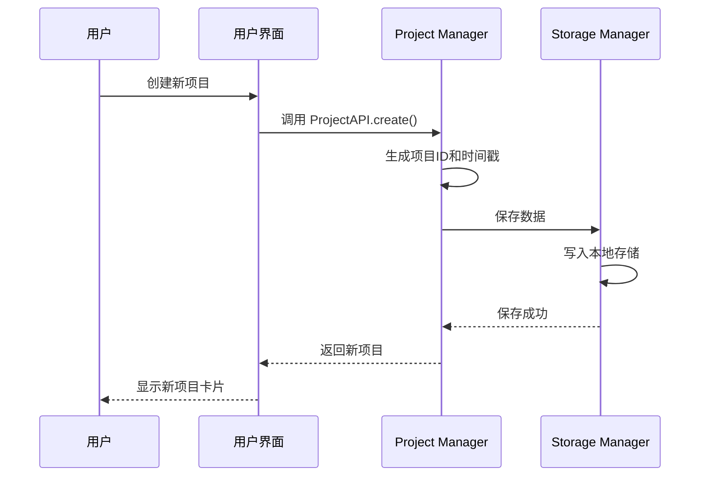
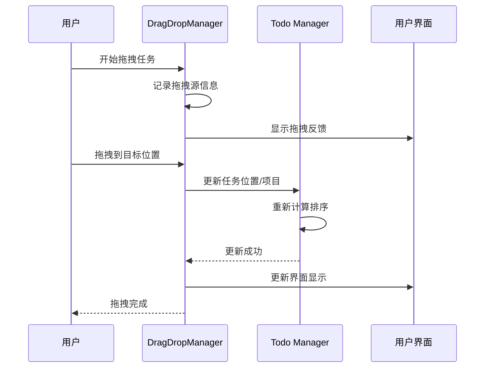

# Core Workflows

## 项目管理工作流

```mermaid
sequenceDiagram
    participant U as 用户
    participant UI as 用户界面
    participant PM as Project Manager
    participant SM as Storage Manager
    
    U->>UI: 创建新项目
    UI->>PM: 调用 ProjectAPI.create()
    PM->>PM: 生成项目ID和时间戳
    PM->>SM: 保存数据
    SM->>SM: 写入本地存储
    SM-->>PM: 保存成功
    PM-->>UI: 返回新项目
    UI-->>U: 显示新项目卡片
```

## 任务拖拽工作流

```mermaid
sequenceDiagram
    participant U as 用户
    participant DND as DragDropManager
    participant TM as Todo Manager
    participant UI as 用户界面
    
    U->>DND: 开始拖拽任务
    DND->>DND: 记录拖拽源信息
    DND->>UI: 显示拖拽反馈
    U->>DND: 拖拽到目标位置
    DND->>TM: 更新任务位置/项目
    TM->>TM: 重新计算排序
    TM-->>DND: 更新成功
    DND->>UI: 更新界面显示
    DND-->>U: 拖拽完成
```
