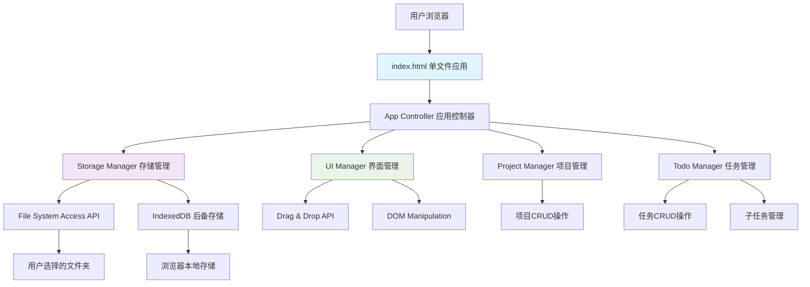

# High Level Architecture

## Technical Summary
独立开发者Todo工具采用**纯前端单页面应用**架构，完全运行在用户浏览器中，无需后端服务器。通过File System Access API实现用户自主数据存储，IndexedDB作为后备方案，确保数据安全和隐私保护。

## Platform and Infrastructure Choice
- **平台选择：** Web应用，基于现代浏览器
- **部署方式：** 静态文件部署，支持本地运行
- **基础设施：** 零服务器依赖，纯客户端架构
- **数据存储：** 本地文件系统 + IndexedDB双重保障

## Repository Structure
```
todo-tool/
├── index.html              # 单文件应用入口
├── assets/
│   ├── styles/
│   │   ├── main.css        # 主样式文件
│   │   ├── components.css  # 组件样式
│   │   └── themes.css      # 主题定制
│   ├── scripts/
│   │   ├── app.js          # 应用主逻辑
│   │   ├── storage.js      # 数据存储模块
│   │   ├── drag-drop.js    # 拖拽功能
│   │   └── utils.js        # 工具函数
│   └── icons/
│       └── svg/            # SVG图标集
├── docs/
│   ├── prd.md              # 产品需求文档
│   ├── front-end-spec.md   # 前端规范
│   └── user-guide.md       # 用户指南
└── tests/
    ├── unit/               # 单元测试
    └── integration/        # 集成测试
```

## Architecture Diagram


## Architectural Patterns
- **MVC架构模式：** Model(数据层) + View(DOM) + Controller(业务逻辑)
- **模块化设计：** ES6模块分离关注点，保持代码清晰
- **事件驱动：** DOM事件 + 自定义事件实现组件通信
- **单一职责：** 每个模块专注特定功能域
- **依赖注入：** 通过配置对象管理模块依赖关系
