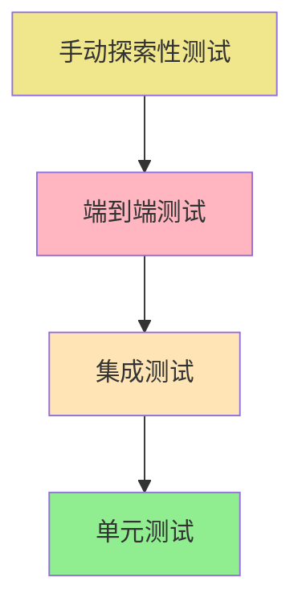

# Testing Strategy

## 测试金字塔


## Unit Testing (单元测试)
**测试框架：** QUnit (轻量级，零依赖)

**测试用例示例：**
```javascript
// tests/unit/ProjectManager.test.js
QUnit.test("ProjectManager.create() should create new project", function(assert) {
  const projectData = {
    name: "Test Project",
    description: "Test Description"
  };
  
  const project = ProjectManager.create(projectData);
  
  assert.ok(project.id, "Project should have an ID");
  assert.equal(project.name, "Test Project", "Name should match");
  assert.ok(project.createdAt instanceof Date, "Should have creation date");
});
```

## Integration Testing (集成测试)
**测试框架：** Puppeteer

**测试场景：**
```javascript
// tests/integration/user-flows.test.js
describe('Project Management Flow', () => {
  test('User can create, edit, and delete project', async () => {
    await page.goto('http://localhost:8080');
    
    // 创建项目
    await page.click('#add-project-btn');
    await page.type('#project-name-input', 'New Project');
    await page.click('#save-project-btn');
    
    // 验证项目创建成功
    const projectCard = await page.waitForSelector('.project-card');
    expect(projectCard).toBeTruthy();
  });
});
```

## Manual Testing Checklist
- [ ] 拖拽功能在所有目标浏览器正常工作
- [ ] File System Access API权限请求正确
- [ ] 响应式设计在不同设备上表现良好
- [ ] 键盘导航完整可用
- [ ] 无障碍功能符合WCAG AA标准
