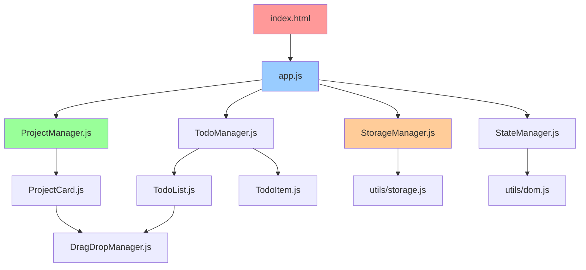

# Unified Project Structure

## Monorepo Structure
```
todo-tool/
├── README.md                    # 项目说明
├── index.html                   # 应用入口
├── manifest.json                # PWA清单文件
├── service-worker.js            # 服务工作者（可选）
│
├── assets/                      # 静态资源
│   ├── styles/
│   │   ├── main.css            # 主样式
│   │   ├── components.css      # 组件样式
│   │   ├── themes.css          # 主题样式
│   │   └── responsive.css      # 响应式样式
│   │
│   ├── scripts/
│   │   ├── app.js              # 应用主入口
│   │   ├── config.js           # 配置管理
│   │   │
│   │   ├── components/         # UI组件
│   │   │   ├── ProjectCard.js
│   │   │   ├── TodoList.js
│   │   │   ├── TodoItem.js
│   │   │   ├── SubtaskItem.js
│   │   │   └── SettingsModal.js
│   │   │
│   │   ├── managers/           # 业务管理器
│   │   │   ├── ProjectManager.js
│   │   │   ├── TodoManager.js
│   │   │   ├── StorageManager.js
│   │   │   ├── DragDropManager.js
│   │   │   └── StateManager.js
│   │   │
│   │   └── utils/              # 工具函数
│   │       ├── dom.js
│   │       ├── storage.js
│   │       ├── validation.js
│   │       └── helpers.js
│   │
│   └── icons/                  # 图标资源
│       ├── project.svg
│       ├── todo.svg
│       ├── settings.svg
│       └── drag-handle.svg
│
├── docs/                       # 文档
│   ├── prd.md                  # 产品需求文档
│   ├── architecture.md         # 架构文档
│   ├── front-end-spec.md       # 前端规范
│   ├── user-guide.md           # 用户指南
│   └── api-docs.md             # API文档
│
├── tests/                      # 测试文件
│   ├── unit/
│   │   ├── ProjectManager.test.js
│   │   ├── TodoManager.test.js
│   │   └── StorageManager.test.js
│   │
│   ├── integration/
│   │   ├── user-flows.test.js
│   │   └── drag-drop.test.js
│   │
│   └── fixtures/               # 测试数据
│       └── sample-data.json
│
└── deployment/                 # 部署配置
    ├── netlify.toml            # Netlify配置
    ├── vercel.json             # Vercel配置
    └── docker/                 # Docker配置（可选）
        └── Dockerfile
```

## File Dependencies
**依赖关系图：**

