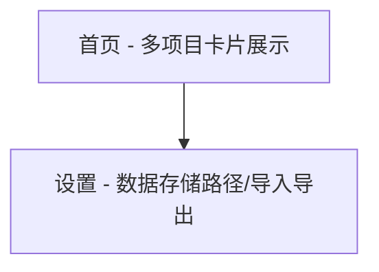
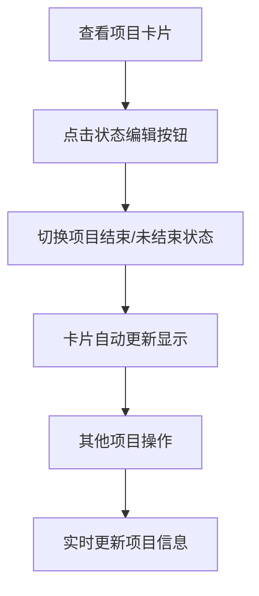
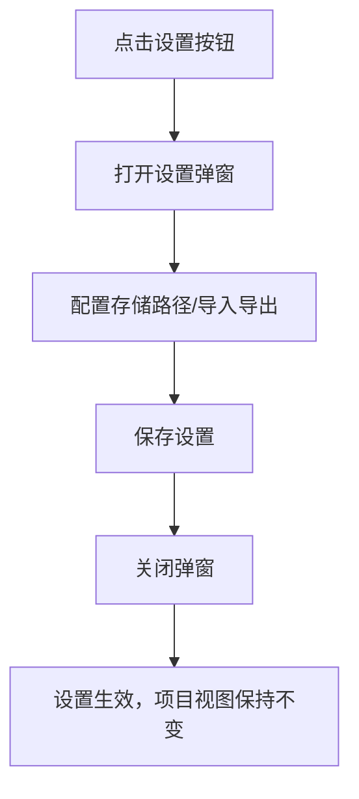
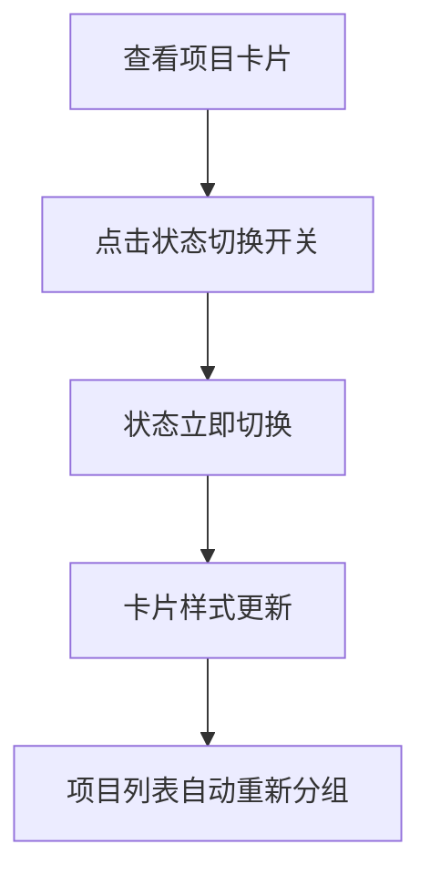

# {{project_name}} UI/UX Specification

## Introduction

This document defines the user experience goals, information architecture, user flows, and visual design specifications for {{project_name}}'s user interface. It serves as the foundation for visual design and frontend development, ensuring a cohesive and user-centered experience.

### Overall UX Goals & Principles

#### Target User Personas

- **Power User:** Technical professionals who need advanced features and efficiency
- **Casual User:** Occasional users who prioritize ease of use and clear guidance
- **Administrator:** System managers who need control and oversight capabilities

#### Usability Goals

- **Ease of learning:** New users can complete core tasks within 5 minutes
- **Efficiency of use:** Power users can complete frequent tasks with minimal clicks
- **Error prevention:** Clear validation and confirmation for destructive actions
- **Memorability:** Infrequent users can return without relearning

#### Design Principles

1. **Clarity over cleverness** - Prioritize clear communication over aesthetic innovation
2. **Progressive disclosure** - Show only what's needed, when it's needed
3. **Consistent patterns** - Use familiar UI patterns throughout the application
4. **Immediate feedback** - Every action should have a clear, immediate response
5. **Accessible by default** - Design for all users from the start

### Change Log

| Date | Version | Description | Author |
|------|---------|-------------|--------|
| 2025-08-06 | 1.0 | Initial UI/UX specification document | UX Expert |
| 2025-08-09 | 1.1 | 添加用户引导流程实现细节 | Sarah (PO) |

## Information Architecture (IA)

### Site Map / Screen Inventory



### Navigation Structure

**Primary Navigation:** 简洁的顶部导航，首页和设置两个主要入口

**Secondary Navigation:** 不需要，单页面应用设计

**Breadcrumb Strategy:** 简单的路径指示（当前场景下可能不需要）

## User Flows

### 项目查看和切换流程

**User Goal:** 查看未结束项目，可切换查看已结束项目

**Entry Points:** 首页（唯一页面）

**Success Criteria:** 用户能够快速查看项目状态，轻松切换显示模式

#### Flow Diagram

```mermaid
graph TD
    A[进入应用] --> B[显示未结束项目卡片网格]
    B --> C[用户点击"显示已结束项目"切换]
    C --> D[切换显示已结束项目卡片]
    D --> E[用户点击"显示未结束项目"切换]
    E --> B
```

#### Edge Cases & Error Handling:
- 项目加载失败时的错误提示
- 无项目时的空状态处理
- 项目操作权限验证

### 项目管理流程

**User Goal:** 在项目卡片上完成所有项目操作

**Entry Points:** 项目卡片上的操作按钮

**Success Criteria:** 用户能够直接在卡片上完成项目状态编辑和其他操作

#### Flow Diagram



#### Edge Cases & Error Handling:
- 弹窗设置时的背景页面交互控制
- 状态切换时的数据同步问题
- 大量项目时的网格布局适配
- 设置弹窗的遮罩层和键盘操作支持

### 系统设置流程

**User Goal:** 配置数据存储路径和导入导出功能

**Entry Points:** 设置按钮（触发弹窗）

**Success Criteria:** 用户能够在弹窗中完成所有设置，不影响当前项目视图

#### Flow Diagram



#### Edge Cases & Error Handling:
- 无效的存储路径错误处理
- 文件格式不匹配的验证
- 导入导出过程中的进度反馈
- 权限不足的错误提示

### 项目状态管理流程

**User Goal:** 编辑项目的结束/未结束状态

**Entry Points:** 项目卡片上的状态切换控件

**Success Criteria:** 用户能够直观地切换项目状态，界面实时响应

#### Flow Diagram



#### Edge Cases & Error Handling:
- 状态切换失败时的错误提示
- 网络连接问题的处理
- 数据同步冲突的解决

## Wireframes & Mockups

### Primary Design Files
**Primary Design Files:** 建议使用 Figma 或 Sketch 创建详细的设计稿

### Key Screen Layouts

#### 主页面布局

**Purpose:** 展示项目卡片网格，提供所有核心功能

**Key Elements:**
- **顶部导航栏:** 应用标题、设置按钮、状态切换按钮
- **项目卡片网格:** 响应式网格布局，一行多列显示项目卡片
- **状态切换器:** "未结束项目" / "已结束项目" 切换按钮
- **设置弹窗:** 模态弹窗，包含数据存储路径和导入导出功能

**Interaction Notes:** 项目卡片支持悬停效果和点击操作，状态切换实时更新卡片显示，设置弹窗支持背景遮罩和键盘操作

**Design File Reference:** [Figma 主页面设计稿链接]

#### 项目卡片设计

**Purpose:** 在卡片内展示项目信息和提供所有操作功能

**Key Elements:**
- **项目标题:** 清晰的项目名称显示
- **项目简介:** 项目描述信息
- **项目状态:** 视觉化的结束/未结束状态指示器
- **待办列表容器:** 包含待办事项和子任务
- **操作按钮:** 状态切换、编辑、删除等操作

**Interaction Notes:** 状态切换开关直接在卡片上操作，支持卡片级别的快速操作，状态变更时卡片样式实时更新

**Design File Reference:** [Figma 项目卡片设计稿链接]

#### 设置弹窗设计

**Purpose:** 提供系统配置功能，不影响主页面操作

**Key Elements:**
- **弹窗标题:** "系统设置"
- **存储路径设置:** 文件路径选择器和验证
- **导入功能:** 文件选择器和格式验证
- **导出功能:** 格式选择和位置设置
- **操作按钮:** 保存、取消、应用

**Interaction Notes:** 支持拖拽文件导入，实时路径验证和错误提示，保存后自动关闭弹窗

**Design File Reference:** [Figma 设置弹窗设计稿链接]

## Component Library / Design System

### Design System Approach
**Design System Approach:** 混合方法 - 使用现有UI组件库作为基础，根据项目需求进行定制化开发

### Core Components

#### 项目卡片组件 (ProjectCard)

**Purpose:** 完整的项目管理单元，包含项目信息、待办事项和子任务管理

**Variants:**
- **展开状态:** 显示完整的待办列表和子任务
- **折叠状态:** 仅显示项目基本信息和待办统计
- **活跃状态:** 未结束项目的默认样式
- **完成状态:** 已结束项目的视觉区分样式

**States:** 默认状态、悬停状态、展开状态、折叠状态、编辑状态、拖拽状态

**Detailed Component Structure:**

**项目头部区域**
- **项目名称:** 可编辑的标题字段
- **项目简介:** 可编辑的描述文本
- **项目状态:** 结束/未结束切换开关
- **项目统计:** 待办完成进度、子任务数量
- **操作按钮:** 编辑、删除、折叠/展开

**待办列表容器 (TodoContainer)**
- **添加待办:** 输入框 + 添加按钮
- **待办列表:** 可拖拽排序的待办事项列表
- **待办项 (TodoItem):**
  - 复选框（完成状态）
  - 待办文本（可编辑）
  - 删除按钮
  - 拖拽手柄
  - 子任务计数器

**子任务容器 (SubtaskContainer)**
- **添加子任务:** 输入框 + 添加按钮（仅在待办展开时显示）
- **子任务列表:** 可拖拽排序的子任务列表
- **子任务项 (SubtaskItem):**
  - 复选框（完成状态）
  - 子任务文本（可编辑）
  - 删除按钮
  - 拖拽手柄

**懒加载功能**
- **虚拟滚动:** 大量待办时的性能优化
- **分页加载:** 滚动到底部时加载更多
- **加载状态:** 显示加载指示器
- **错误处理:** 加载失败时的重试机制

**Usage Guidelines:** 卡片高度根据内容自适应，设置最大高度避免过长；待办和子任务支持多层级的拖拽排序；所有编辑操作支持就地编辑，无需弹窗；懒加载阈值设置为可视区域的2倍

#### 网格布局组件 (ProjectGrid)

**Purpose:** 管理项目卡片的响应式网格布局

**Variants:**
- **紧凑布局:** 每行更多卡片
- **舒适布局:** 卡片间距更大
- **列表布局:** 单列显示（移动端）

**States:** 加载状态、空状态、错误状态

**Usage Guidelines:** 根据屏幕尺寸自动调整列数；支持无限滚动或分页；空状态时显示引导信息

#### 状态切换器组件 (StatusToggle)

**Purpose:** 在未结束和已结束项目视图间切换

**Variants:**
- **按钮组:** 两个按钮的切换组
- **标签页:** 标签页样式切换
- **下拉菜单:** 下拉选择样式

**States:** 选中状态、未选中状态、禁用状态

**Usage Guidelines:** 当前状态有明显的视觉指示；支持键盘导航；状态切换时有平滑过渡

#### 设置弹窗组件 (SettingsModal)

**Purpose:** 提供系统设置功能的模态弹窗

**Variants:**
- **完整设置:** 包含所有设置选项
- **简化设置:** 只显示常用设置
- **向导设置:** 分步骤的设置引导

**States:** 打开状态、关闭状态、加载状态、错误状态

**Usage Guidelines:** 支持背景遮罩点击关闭；支持ESC键关闭；表单验证和错误提示

#### 开关组件 (ToggleSwitch)

**Purpose:** 在项目卡片上切换项目状态

**Variants:**
- **标准开关:** 基础的开关样式
- **带标签开关:** 显示"未结束"/"已结束"标签
- **图标开关:** 使用图标表示状态

**States:** 开启状态、关闭状态、加载状态、禁用状态

**Usage Guidelines:** 状态变更时立即生效；提供状态变更的视觉反馈；支持批量操作（如果需要）

#### 按钮组件 (Button)

**Purpose:** 统一的按钮样式和交互

**Variants:**
- **主要按钮:** 重要操作，如保存
- **次要按钮:** 次要操作，如取消
- **文本按钮:** 低优先级操作
- **图标按钮:** 仅图标显示

**States:** 默认状态、悬停状态、点击状态、禁用状态、加载状态

**Usage Guidelines:** 根据操作重要性选择合适变体；禁用状态要有明显的视觉区分；加载状态显示进度指示器

#### 待办事项组件 (TodoItem)

**Purpose:** 单个待办事项的完整管理

**States:** 完成/未完成、编辑模式、拖拽中

**Interaction:** 点击完成、双击编辑、拖拽排序

#### 子任务组件 (SubtaskItem)

**Purpose:** 子任务的管理，与待办事项类似但层级更低

**States:** 完成/未完成、编辑模式、拖拽中

**Interaction:** 与待办事项相同的交互模式

#### 拖拽排序组件 (DragDropList)

**Purpose:** 为待办和子任务提供拖拽排序功能

**Variants:** 待办列表、子任务列表

**Features:** 平滑动画、视觉反馈、键盘支持

#### 懒加载容器组件 (LazyLoadContainer)

**Purpose:** 处理大量数据的性能优化

**Variants:** 待办列表、子任务列表

**Features:** 虚拟滚动、分页加载、错误恢复

## Branding & Style Guide

### Visual Identity
**Brand Guidelines:** 建议创建简洁的品牌指南，强调功能性和专业性

### Color Palette

| Color Type | Hex Code | Usage |
|------------|----------|-------|
| Primary | #3B82F6 | Main buttons, important links, selected states |
| Secondary | #10B981 | Success states, completion indicators, positive feedback |
| Accent | #F59E0B | Warning states, attention-needed actions |
| Success | #10B981 | Positive feedback, confirmations, completion states |
| Warning | #F59E0B | Warnings, important notices, cautious actions |
| Error | #EF4444 | Errors, destructive actions, failure states |
| Neutral | #6B7280 | Secondary text, borders, backgrounds |

### Typography

#### Font Families
- **Primary:** Inter or System-ui
- **Secondary:** Inter or System-ui
- **Monospace:** JetBrains Mono or SF Mono

#### Type Scale

| Element | Size | Weight | Line Height |
|----------|------|--------|-------------|
| H1 | 32px | 700 | 1.2 |
| H2 | 24px | 600 | 1.3 |
| H3 | 20px | 600 | 1.4 |
| Body | 16px | 400 | 1.5 |
| Small | 14px | 400 | 1.4 |

### Iconography
**Icon Library:** Lucide Icons or Heroicons

**Usage Guidelines:** Icon style should be consistent, using linear design; icon sizes should be adjusted based on usage context (16px, 20px, 24px); maintain appropriate spacing between icons and text; use icons as auxiliary identification elements in interactive elements

### Spacing & Layout
**Grid System:** 8px grid system

**Spacing Scale:**
- Micro spacing: 4px, 8px
- Small spacing: 12px, 16px
- Medium spacing: 24px, 32px
- Large spacing: 48px, 64px
- Extra large spacing: 96px, 128px

## Accessibility Requirements

### Compliance Target
**Standard:** WCAG 2.1 AA Level

### Key Requirements

#### Visual:
- **Color contrast ratios:** Text to background contrast at least 4.5:1, large text at least 3:1
- **Focus indicators:** All interactive elements have clear focus indicators using 2px blue borders
- **Text sizing:** Support browser zoom to 200% without breaking layout
- **Color dependency:** Don't use color as the only way to convey information

#### Interaction:
- **Keyboard navigation:** All functions accessible via keyboard using Tab, Enter, Space, Escape keys
- **Screen reader support:** All interactive elements have appropriate ARIA labels and roles
- **Touch targets:** All clickable elements have minimum size of 44x44px
- **Operation time:** Provide sufficient time to complete operations, avoid automatic timeouts

#### Content:
- **Alternative text:** All meaningful images have descriptive alt text
- **Heading structure:** Use semantic heading structure (H1 → H2 → H3)
- **Form labels:** All form controls have clear labels using label elements
- **Error prompts:** Provide clear, specific error messages and resolution suggestions

### Component-Specific Accessibility Implementation

#### Project Card Component:
- Use `aria-label` to describe card content
- Status toggle switch uses `aria-checked` attribute
- Drag functionality supports keyboard operations
- Expand/collapse state uses `aria-expanded` attribute

#### Todo Item Component:
- Checkbox uses standard `checkbox` role
- Auto-focus on input field when in edit mode
- Delete operations have confirmation dialog
- Voice prompts for status changes

#### Drag Functionality:
- Provide keyboard drag alternatives
- Visual feedback during dragging
- Screen reader notifications for position changes
- Provide shortcut keys to cancel dragging

#### Settings Modal:
- Use `aria-modal` attribute
- Proper focus management when modal is open
- Support keyboard navigation and closing
- Background content uses `aria-hidden`

### Testing Strategy

#### Automated Testing:
- Use axe-core or Lighthouse for automated accessibility testing
- Integrate into CI/CD pipeline
- Regular scanning and issue resolution

#### Manual Testing:
- Test with screen readers (NVDA, VoiceOver, JAWS)
- Keyboard-only navigation testing
- High contrast mode testing
- Different zoom level testing

#### User Testing:
- Invite users with disabilities to participate in testing
- Collect actual usage feedback
- Iterative accessibility experience improvement

### Development Standards:
- All new features must pass accessibility testing
- Use semantic HTML elements
- Provide complete keyboard support
- Ensure sufficient color contrast
- Add appropriate ARIA labels

## Responsiveness Strategy

### Breakpoints

| Breakpoint | Min Width | Max Width | Target Devices |
|------------|-----------|-----------|----------------|
| Mobile | 320px | 767px | Smartphones, small tablets |
| Tablet | 768px | 1023px | Tablets, large phones |
| Desktop | 1024px | 1439px | Laptops, small monitors |
| Wide | 1440px | - | Desktops, large monitors |

### Adaptation Patterns

#### Layout Changes:
- **Mobile:** Single column layout, project cards arranged vertically, simplified operation interface
- **Tablet:** 2-column grid layout, optimized touch target sizes
- **Desktop:** 3-4 column grid layout, complete mouse interaction features
- **Wide:** 4-6 column grid layout, possible sidebar or additional information

#### Navigation Changes:
- **Mobile:** Bottom fixed navigation bar, large button design, convenient for thumb operation
- **Tablet:** Top navigation or side navigation, moderate button sizes
- **Desktop:** Top navigation bar, complete menus and quick operations
- **Wide:** Possible multi-level navigation or advanced function entries

#### Content Priority:
- **Mobile:** Only show core functions: project name, status, basic todos
- **Tablet:** Add project description, todo statistics, simple operations
- **Desktop:** Complete project card functionality, including all operations and details
- **Wide:** Possible additional information, advanced functions, batch operations

#### Interaction Changes:
- **Mobile:** Touch-first, long-press operations, swipe switching, click to expand
- **Tablet:** Touch and pointer mixed, gesture support, hover effects
- **Desktop:** Pointer-first, drag operations, right-click menus, keyboard shortcuts
- **Wide:** Advanced interactions, multi-window support, batch operations

### Component-Specific Responsive Implementation

#### Project Card Component:
- **Mobile:** Simplified version, only core information, click to expand details
- **Tablet:** Standard version, complete information, optimized touch targets
- **Desktop:** Complete version, all functions, support drag and advanced operations
- **Wide:** Enhanced version, possible additional information or preview

#### Todo List:
- **Mobile:** Simplified list, basic add/delete/edit functions
- **Tablet:** Complete list, support subtask expansion
- **Desktop:** Advanced list, support drag sorting, batch operations
- **Wide:** Possible multi-column display or advanced filtering

#### Settings Modal:
- **Mobile:** Full-screen modal, simplified form, large buttons
- **Tablet:** Standard modal, complete settings options
- **Desktop:** Modal dialog, possible multi-tab or advanced settings
- **Wide:** Possible non-modal dialog or side panel

### Performance Optimization:
- **Mobile:** Lazy loading, virtual scrolling, reduced animations
- **Tablet:** Moderate animations, optimized touch response
- **Desktop:** Complete animations and transition effects
- **Wide:** Advanced visual effects, smooth animations

## Animation & Micro-interactions

### Motion Principles:
- **Functionality first:** Every animation should have a clear purpose
- **Performance friendly:** Use GPU-accelerated animation properties
- **User control:** Provide options to reduce animations
- **Consistency:** Maintain consistent animation style and duration
- **Moderation:** Avoid excessive animations affecting user attention

### Key Animations

#### Project Card Expand/Collapse Animation
- **Description:** Smooth height change, fade in/out of sub-content
- **Duration:** 300ms
- **Easing:** cubic-bezier(0.4, 0, 0.2, 1)
- **Trigger:** Click expand/collapse button

#### Project Status Toggle Animation
- **Description:** Color gradient of status indicator, possible slight scaling effect
- **Duration:** 200ms
- **Easing:** cubic-bezier(0.4, 0, 0.2, 1)
- **Trigger:** Click status toggle switch

#### Todo Item Completion Animation
- **Description:** Checkbox check animation, text strikethrough effect
- **Duration:** 250ms
- **Easing:** cubic-bezier(0.4, 0, 0.2, 1)
- **Trigger:** Click checkbox

#### Drag Sorting Animation
- **Description:** Shadow effect during dragging, smooth position transition, placeholder display
- **Duration:** 150ms
- **Easing:** cubic-bezier(0.4, 0, 0.2, 1)
- **Trigger:** Start dragging, dragging, placing

#### Modal Show/Hide Animation
- **Description:** Modal fade in/out, slight scaling effect
- **Duration:** 200ms
- **Easing:** cubic-bezier(0.4, 0, 0.2, 1)
- **Trigger:** Open/close modal

#### Button Interaction Animation
- **Description:** Button hover effect, click scaling feedback
- **Duration:** 100ms
- **Easing:** cubic-bezier(0.4, 0, 0.2, 1)
- **Trigger:** Mouse hover, click

#### Loading State Animation
- **Description:** Loading indicator rotation, content area skeleton screen effect
- **Duration:** Looping animation
- **Easing:** linear
- **Trigger:** Data loading

#### Error Prompt Animation
- **Description:** Error information slide-in effect, slight shake to attract attention
- **Duration:** 300ms
- **Easing:** cubic-bezier(0.68, -0.55, 0.265, 1.55)
- **Trigger:** Display error information

### Micro-interaction Details:

#### Hover Effects:
- Slight shadow enhancement for project cards
- Color changes and border effects for buttons
- Cursor changes for clickable elements
- Underline display for links

#### Focus States:
- Focus ring display during keyboard navigation
- Background color changes for focused elements
- Smooth transition of focus indicators

#### Status Feedback:
- Green prompt for successful operations
- Red prompt for failed operations
- Loading state for saving
- Progress indication for data synchronization

#### Transition Effects:
- Fade in/out for page transitions
- Height自适应 for content areas
- Smooth transition for color changes
- Movement animation for position changes

### Performance Considerations:
- Use `transform` and `opacity` for animations
- Avoid using `box-shadow` and `filter` in animations
- Use `will-change` property for performance optimization
- Reduce animation complexity on low-end devices

### Accessibility Considerations:
- Provide `prefers-reduced-motion` support
- Ensure animations don't cause seizures
- Provide alternative feedback for important animations
- Keep animation duration within reasonable range

## Performance Considerations

### Performance Goals:
- **Page Load:** First screen load time < 2 seconds, complete load < 4 seconds
- **Interaction Response:** User operation response time < 100ms
- **Animation FPS:** Maintain 60fps for animations
- **Memory Usage:** Browser memory usage < 100MB

### Design Strategies:

#### Data Loading Optimization:
- **Lazy Loading:** Project cards and todos load on demand
- **Pagination:** Batch loading for large data, avoid one-time loading too much
- **Cache Strategy:** Reasonable use of browser cache and local storage
- **Data Prefetching:** Predict user behavior, load needed data in advance

#### Rendering Performance Optimization:
- **Virtual Scrolling:** Use virtual scrolling for large todo lists
- **Debouncing/Throttling:** Use debouncing/throttling for search and auto-save operations
- **Batch Updates:** Avoid frequent DOM updates, use batch processing
- **Avoid Reflows:** Optimize CSS selectors, avoid forced reflow operations

#### Component Performance Optimization:
- **Component Lazy Loading:** Delay loading non-critical components
- **Memoization:** Use React.memo or similar technology to avoid unnecessary re-renders
- **Code Splitting:** Split code by functional modules, load on demand
- **Tree Shaking:** Remove unused code, reduce package size

#### Image and Resource Optimization:
- **Image Compression:** Use appropriate image formats and compression
- **Font Optimization:** Use font subsets, reduce font file size
- **Icon Optimization:** Use SVG icons, avoid image icons
- **Resource Compression:** Enable Gzip or Brotli compression

### Scenario-Specific Performance Considerations:

#### Project Card Performance:
- **Lazy Loading:** Only render cards in visible area
- **Virtualization:** Use virtual scrolling for large projects
- **Optimized Updates:** Only update changed project cards
- **State Management:** Use efficient state management solutions

#### Todo Performance:
- **Virtual Scrolling:** Use virtual scrolling for large todos
- **Batch Operations:** Support batch updates, reduce individual operations
- **Local Cache:** Local cache for todo data, reduce network requests
- **Incremental Updates:** Only sync changed todos

#### Drag Performance:
- **Hardware Acceleration:** Use transform for drag animations
- **Event Delegation:** Use event delegation for many drag elements
- **Collision Detection Optimization:** Optimize collision detection algorithm during dragging
- **Prerendering:** Prerender placeholders during dragging

#### Data Sync Performance:
- **Incremental Sync:** Only sync changed data
- **Conflict Resolution:** Gracefully handle data conflicts
- **Offline Support:** Support offline operations, sync after network recovery
- **Background Sync:** Perform data sync in background, don't affect user experience

### Monitoring and Optimization:
- **Performance Monitoring:** Use Lighthouse and Web Vitals to monitor performance
- **Error Monitoring:** Monitor JavaScript errors and performance issues
- **User Behavior Analysis:** Analyze user behavior, identify performance bottlenecks
- **A/B Testing:** A/B test performance optimizations

### Mobile Performance Optimization:
- **Reduce Network Requests:** Merge requests, reduce HTTP request count
- **Optimize Touch Response:** Use touch events to optimize touch response
- **Reduce Animations:** Reduce animation complexity on low-end devices
- **Battery Optimization:** Reduce unnecessary background operations

## Next Steps

### Immediate Actions:

1. **Design Review Meeting**
   - Conduct design review with product owner, development team, and stakeholders
   - Collect feedback and document areas needing modification
   - Ensure everyone reaches consensus on the design solution

2. **Visual Design Refinement**
   - Create high-fidelity design mockups in Figma
   - Refine visual details for all components
   - Create interactive prototypes demonstrating key flows

3. **Design System Construction**
   - Build complete design system documentation
   - Create reusable component library
   - Establish design specifications and standards

4. **Technical Feasibility Assessment**
   - Assess technical implementation difficulty with development team
   - Identify potential technical risks and challenges
   - Develop technical implementation plan

### Design Handoff Checklist:

- **✅ All user flows documented**
  - Main user flows completely described
  - Edge cases and error handling considered
  - Interaction details clearly defined

- **✅ Component inventory complete**
  - All core components defined
  - Component states and variants clarified
  - Component relationships understood

- **✅ Accessibility requirements defined**
  - WCAG 2.1 AA level compliance requirements
  - Specific component accessibility implementation
  - Testing strategy established

- **✅ Responsive strategy clear**
  - Adaptation plans for all breakpoints
  - Functional differences across devices
  - Performance optimization strategies established

- **✅ Brand guidelines incorporated**
  - Color system and typography specifications
  - Component style guidelines
  - Animation and interaction specifications

- **✅ Performance goals established**
  - Key performance metrics defined
  - Performance optimization strategies developed
  - Monitoring solutions planned

### Development Preparation:

1. **Frontend Architecture Design**
   - Design technical architecture with frontend architect
   - Determine technology stack and framework selection
   - Establish code standards and project structure

2. **Component Development Planning**
   - Establish component development priorities
   - Allocate development resources and time
   - Build component testing strategy

3. **Data Structure Design**
   - Design data structures for projects, todos, subtasks
   - Develop data synchronization strategy
   - Design local storage solution

4. **API Design**
   - Collaborate with backend team to design API interfaces
   - Determine data formats and protocols
   - Develop error handling strategy

### Testing and Release:

1. **User Experience Testing**
   - Recruit target users for testing
   - Collect user feedback and improvement suggestions
   - Iteratively optimize design

2. **Performance Testing**
   - Conduct performance benchmark testing
   - Optimize key performance indicators
   - Ensure performance across various devices

3. **Accessibility Testing**
   - Use professional tools for accessibility testing
   - Invite users with disabilities to participate in testing
   - Ensure compliance with accessibility standards

4. **Release Planning**
   - Develop phased release plan
   - Prepare user training materials
   - Establish user feedback collection mechanism

### Continuous Improvement:

1. **User Feedback Collection**
   - Establish user feedback channels
   - Regularly collect and analyze user feedback
   - Develop product improvement plans

2. **Data Analysis**
   - Build user behavior analysis system
   - Monitor key metrics and user behavior
   - Make data-driven product decisions

3. **Design Iteration**
   - Regularly review and update design system
   - Optimize design based on user feedback
   - Keep synchronized with industry best practices

## 用户引导流程实现细节

### 首次使用引导系统

#### 引导触发条件
- 用户首次访问应用（检测localStorage中是否有 `has_completed_onboarding` 标记）
- 用户手动重置引导（设置中的"重新引导"选项）
- 重大版本更新后（检测版本号变化）

#### 引导流程设计

##### 第一步：欢迎与概述（30秒）
```javascript
// 引导步骤1：欢迎界面
{
  target: 'body',
  title: '欢迎使用独立开发者Todo工具！',
  content: `
    <div class="onboarding-welcome">
      <p>这个工具专为独立开发者设计，帮你高效管理多个项目的任务。</p>
      <p><strong>2分钟教程</strong>让你快速上手核心功能。</p>
      <ul>
        <li>✅ 项目管理</li>
        <li>✅ 任务追踪</li>  
        <li>✅ 拖拽排序</li>
        <li>✅ 数据本地化</li>
      </ul>
    </div>
  `,
  placement: 'center',
  showSkip: true
}
```

##### 第二步：数据存储设置（30秒）
```javascript
// 引导步骤2：存储设置
{
  target: '.settings-button',
  title: '数据存储设置（可选）',
  content: `
    <p>你可以选择数据存储位置：</p>
    <ul>
      <li><strong>推荐：</strong>选择云盘文件夹实现多设备同步</li>
      <li><strong>默认：</strong>使用浏览器本地存储</li>
    </ul>
    <p><small>💡 提示：可稍后在设置中修改</small></p>
  `,
  placement: 'bottom',
  showSkip: false,
  nextButton: '继续',
  prevButton: '上一步'
}
```

##### 第三步：创建第一个项目（30秒）
```javascript
// 引导步骤3：项目创建
{
  target: '.add-project-button',
  title: '创建你的第一个项目',
  content: `
    <p>点击这里创建一个项目来组织你的任务。</p>
    <p><strong>示例：</strong></p>
    <ul>
      <li>项目名称："我的网站重构"</li>
      <li>描述："使用React重构个人博客"</li>
    </ul>
  `,
  placement: 'bottom',
  action: 'highlight',
  nextButton: '创建项目'
}
```

##### 第四步：添加第一个任务（30秒）
```javascript
// 引导步骤4：任务管理
{
  target: '.todo-input',
  title: '添加你的第一个任务',
  content: `
    <p>在这里输入任务内容，按Enter保存。</p>
    <p><strong>示例任务：</strong></p>
    <ul>
      <li>"设置React开发环境"</li>
      <li>"设计新的页面布局"</li>
      <li>"迁移现有内容"</li>
    </ul>
  `,
  placement: 'top',
  action: 'focus',
  nextButton: '添加任务'
}
```

##### 第五步：拖拽功能演示（20秒）
```javascript
// 引导步骤5：拖拽演示
{
  target: '.todo-item:first-child',
  title: '拖拽排序功能',
  content: `
    <p>你可以拖拽任务来调整优先级：</p>
    <ul>
      <li>上下拖拽：调整任务顺序</li>
      <li>左右拖拽项目：调整项目顺序</li>
      <li>跨项目拖拽：移动任务到其他项目</li>
    </ul>
    <p><small>💡 也支持键盘操作</small></p>
  `,
  placement: 'right',
  action: 'animate-drag'
}
```

##### 第六步：完成引导（20秒）
```javascript
// 引导步骤6：完成
{
  target: 'body',
  title: '🎉 完成！你已经掌握基础用法',
  content: `
    <div class="onboarding-completion">
      <p><strong>你现在可以：</strong></p>
      <ul>
        <li>✅ 创建和管理项目</li>
        <li>✅ 添加和组织任务</li>
        <li>✅ 使用拖拽排序</li>
        <li>✅ 随时查看设置选项</li>
      </ul>
      <p>💡 <strong>小贴士：</strong>查看用户指南了解更多高级功能</p>
      <div class="onboarding-actions">
        <button onclick="openUserGuide()">查看完整指南</button>
        <button onclick="completeOnboarding()">开始使用</button>
      </div>
    </div>
  `,
  placement: 'center',
  showSkip: false
}
```

#### 技术实现规范

##### 引导组件结构
```javascript
// OnboardingManager.js
class OnboardingManager {
  constructor() {
    this.steps = ONBOARDING_STEPS;
    this.currentStep = 0;
    this.isActive = false;
    this.overlay = null;
    this.tooltip = null;
  }
  
  start() {
    if (this.shouldShowOnboarding()) {
      this.isActive = true;
      this.showStep(0);
      this.trackEvent('onboarding_started');
    }
  }
  
  showStep(stepIndex) {
    const step = this.steps[stepIndex];
    this.highlightElement(step.target);
    this.showTooltip(step);
    this.updateProgress();
  }
  
  shouldShowOnboarding() {
    return !localStorage.getItem('has_completed_onboarding');
  }
  
  completeOnboarding() {
    localStorage.setItem('has_completed_onboarding', 'true');
    localStorage.setItem('onboarding_completed_at', Date.now());
    this.cleanup();
    this.trackEvent('onboarding_completed');
  }
}
```

##### 样式规范
```css
/* 引导覆盖层 */
.onboarding-overlay {
  position: fixed;
  top: 0;
  left: 0;
  width: 100%;
  height: 100%;
  background: rgba(0, 0, 0, 0.5);
  z-index: 9998;
  transition: opacity 0.3s ease;
}

/* 高亮目标元素 */
.onboarding-highlight {
  position: relative;
  z-index: 9999;
  box-shadow: 0 0 0 4px rgba(59, 130, 246, 0.5);
  border-radius: 4px;
  animation: highlight-pulse 2s infinite;
}

/* 引导提示框 */
.onboarding-tooltip {
  position: absolute;
  max-width: 320px;
  padding: 20px;
  background: white;
  border-radius: 8px;
  box-shadow: 0 10px 25px rgba(0, 0, 0, 0.15);
  z-index: 10000;
  animation: tooltip-appear 0.3s ease;
}

/* 进度指示器 */
.onboarding-progress {
  display: flex;
  justify-content: center;
  margin-bottom: 15px;
  gap: 8px;
}

.onboarding-step {
  width: 8px;
  height: 8px;
  border-radius: 50%;
  background: #e5e7eb;
  transition: background 0.3s ease;
}

.onboarding-step.active {
  background: #3b82f6;
}

.onboarding-step.completed {
  background: #10b981;
}
```

#### 可访问性实现
- 引导过程中保持键盘导航可用
- 使用 `aria-describedby` 连接目标元素和提示内容
- 提供跳过引导的快捷键（Escape）
- 高对比度模式下的视觉优化

#### 跟踪和优化
```javascript
// 引导分析事件
const ONBOARDING_EVENTS = {
  started: 'onboarding_started',
  step_completed: 'onboarding_step_completed',
  skipped: 'onboarding_skipped',
  completed: 'onboarding_completed',
  dropped_at_step: 'onboarding_dropped'
};

// 跟踪用户行为
function trackOnboardingStep(stepIndex, action) {
  AnalyticsManager.trackEvent('onboarding_interaction', {
    step: stepIndex,
    action: action,
    timestamp: Date.now(),
    total_time: Date.now() - onboardingStartTime
  });
}
```

### 渐进式功能发现

#### 功能提示系统
- 用户完成基础操作后显示高级功能提示
- 基于使用频率的智能推荐
- 非侵入式的功能介绍

#### 上下文帮助
- 悬停提示解释复杂功能
- 空状态时的操作引导
- 错误场景下的解决建议

### Open Questions and Decision Needs:

- Project name and brand identity need final determination
- Specific technology stack selection requires development team confirmation
- Data storage and synchronization strategies need technical evaluation
- User permissions and security strategies need further discussion
- Internationalization and localization requirements need confirmation

## Checklist Results

No UI/UX checklist has been run against this document yet.